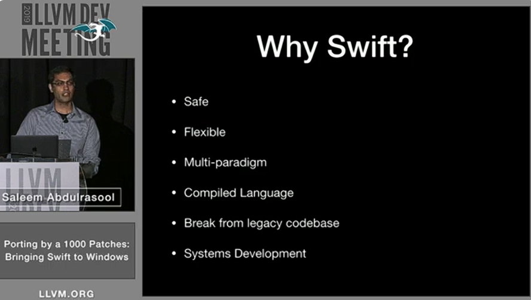
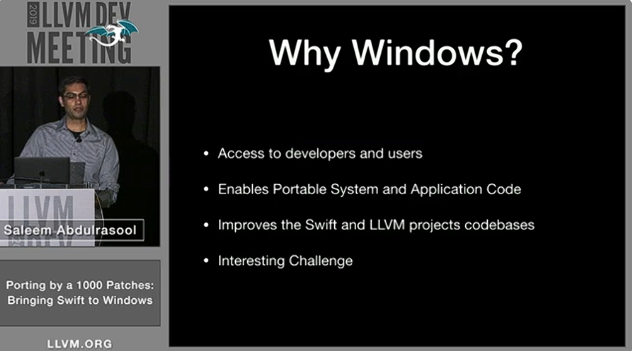
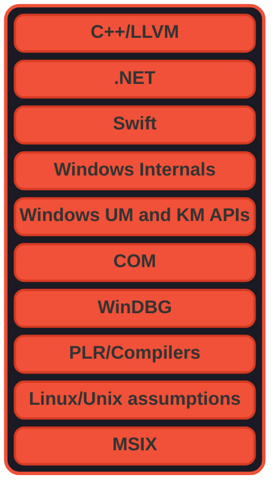

# Swift on Windows Workgroup Knowledge Domains

The following is a list (in no particular order) of the domains of expertise that are generally crossed and often synthesized in the development efforts to port the Swift programming language to the Windows OS and improve the overall developer experience for Swift users on Windows. Included are hyperlinks to some potentially relevant jumping off points

## [Swift on Windows Workgroup](https://www.swift.org/windows-workgroup/)

### Canonical origin for porting Swift to Windows:

Swift is a modern language based upon the LLVM compiler framework. It takes advantage of Clang to provide seamless interoperability with C/C++. The Swift compiler and language are designed to take advantage of modern Unix facilities to the fullest, and this made porting to Windows a particularly interesting task. This talk covers the story of bringing Swift to Windows from the ground up through an unusual route: cross-compilation on Linux. The talk will cover interesting challenges in porting the Swift compiler, standard library, and core libraries that were overcome in the process of bringing Swift to a platform that challenges the Unix design assumptions.

- [2019 LLVM Developers’ Meeting: S. Abdulrasool “Porting by a 1000 Patches: Bringing Swift to Windows”](https://llvm.org/devmtg/2019-10/talk-abstracts.html#tech16)

### Domains of expertise (Macro view):

- [C++, LLVM](https://www.youtube.com/watch?v=J5xExRGaIIY): needed for working on the compiler and runtime
- [Swift](https://www.swift.org/getting-started/): needed for working on the driver, SPM, standard library
- [.NET](https://learn.microsoft.com/en-us/dotnet/standard/clr): needed for working on .NET interoperability, some bits of OS integration
- [Windows Internals](https://learn.microsoft.com/en-us/sysinternals/resources/windows-internals): needed for working on OS integration
- [Windows UM and KM APIs](https://learn.microsoft.com/en-us/windows/win32/learnwin32/learn-to-program-for-windows): needed for working on OS integration
- [COM](https://learn.microsoft.com/en-us/windows/win32/com/component-object-model--com--portal): needed for working on OS integration
- [WinDBG](https://learn.microsoft.com/en-us/windows-hardware/drivers/debugger/getting-started-with-windbg--kernel-mode-): needed for working on OS integration for debugging, profiling
- [PLR/Compilers](https://www.cs.cornell.edu/courses/cs6120/2025fa/self-guided/): needed for working on the compiler
- [Linux/Unix assumptions](https://github.com/stewartweiss/intro-linux-sys-prog): needed for working on porting packages
- [MSIX](https://learn.microsoft.com/en-us/windows/msix/overview): needed for working on packaging and distribution aspects 

