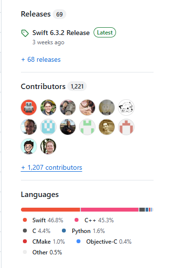

# Swift on Windows Workgroup Knowledge Domains

The following is a list (in no particular order) of the knowledge domains that are generally crossed and often synthesized in the development efforts to port the Swift programming language to the Windows OS and improve the overall developer experience for Swift users on Windows. Included is a learning resource tree that link to some potentially relevant jumping off points for each domain.

### Canonical origin for porting Swift to Windows:

Swift is a modern language based upon the LLVM compiler framework. It takes advantage of Clang to provide seamless interoperability with C/C++. The Swift compiler and language are designed to take advantage of modern Unix facilities to the fullest, and this made porting to Windows a particularly interesting task. This talk covers the story of bringing Swift to Windows from the ground up through an unusual route: cross-compilation on Linux. The talk will cover interesting challenges in porting the Swift compiler, standard library, and core libraries that were overcome in the process of bringing Swift to a platform that challenges the Unix design assumptions.

- [2019 LLVM Developers’ Meeting: S. Abdulrasool “Porting by a 1000 Patches: Bringing Swift to Windows”](https://llvm.org/devmtg/2019-10/talk-abstracts.html#tech16)

### Knowledge Domains (Macro view):

- LLVM: [Swift is a modern language built upon the LLVM compiler framework](#canonical-origin-for-porting-swift-to-windows)
- Objective-C: Historical predecessor that influenced Swift's design
  - *"Many Apple frameworks that you will use are written in Objective-C; even if you if you interact with them using Swift, the error messages that they produce will have an Objective-C "accent", so debugging will be easier if you understand that language."* — Swift Programming: The Big Nerd Ranch Guide, 3rd Edition, pg. 28
- C/C++: Swift runtime is largely C++
  - 
- .NET: Windows Developer Experience and Windows API bindings reference
- Windows Internals/Development: Windows APIs, User mode and Kernel, Component Object Model (COM), WinDbg, etc.
- Swift: Understanding idiomatic Swift on macOS as a reference for parity on Windows
- Clang: [Swift uses Clang for C/C++ interop on macOS](#canonical-origin-for-porting-swift-to-windows)
- Programming Language and Compiler Design and Implementation: Parsers, Abstract Syntax Trees (ASTs), Control Flow graph (CFG), Semantic Analyzer, SIL (Swift Intermediate Language), etc.
- Windows Packaging (MSIX): Understanding native app deployment and distribution methods
- Linux/UNIX Assumptions: 

### Learning Resources:

```mermaid
---
title: Learning Resource Tree
---
flowchart TB

subgraph A0[LLVM]
A1[Intro LLVM]
end

subgraph B0[Objective-C]
B1[Intro Objective-C]
end

subgraph C0[C/C++]
C1[Intro C/C++]
end

subgraph D0[.NET]
D1[Intro .NET]
end

subgraph E0[Windows Internals]
E1[Intro Windows Internals]
end

subgraph F0[Swift]
F1[Intro Swift]
end

subgraph G0[Clang]
G1[Intro Clang]
end

subgraph H0[PLCDI]
H00[SIL]
H1[Advanced Compilers]
H2[CPython Internals]
H3[Golang Specification]
end

subgraph I0[Windows Packaging]
I1[Windows Packaging]
end

click A1 "https://www.youtube.com/watch?v=J5xExRGaIIY" "Introduction to LLVM"

click B1 "https://www.youtube.com/watch?v=oesNwgHn1ws&list=PLNo-a4huL1BW7IicjnkHSnfw2zsyisN_Q" "Introduction to Objective-C"

click C1 "https://learn.microsoft.com/en-us/windows/win32/learnwin32/learn-to-program-for-windows" "Get Started with Win32 and C++"

click D1 "https://learn.microsoft.com/en-us/dotnet/standard/clr" "Common Language Runtime (CLR) overview"

click E1 "https://learn.microsoft.com/en-us/sysinternals/resources/windows-internals" "Windows Internals"

click F1 "https://www.swift.org/getting-started/" "Getting Started with Swift"

click G1 "https://www.youtube.com/watch?v=5kkMpJpIGYU&pp=ygUPbGx2bSAyMDE5IGNsYW5n" "An overview of Clang"

click H00 "https://www.swift.org/documentation/swift-compiler/" "Swift Compiler"

click H1 "https://www.cs.cornell.edu/courses/cs6120/2025fa/self-guided/" "Advanced Compilers: The Self-Guided Online Course"

click H2 "https://realpython.com/cpython-source-code-guide/" "Your Guide to the CPython Source Code"

click H3 "https://go.dev/ref/spec" "The Go Programming Language Specification"

click I1 "https://learn.microsoft.com/en-us/windows/msix/overview" "MSIX documentation"


A0 --- B0
B0 --- C0
C0 --- D0 
D0 --- E0 
E0 --- F0
F0 --- G0
G0 --- H0
H0 --- I0 

```

